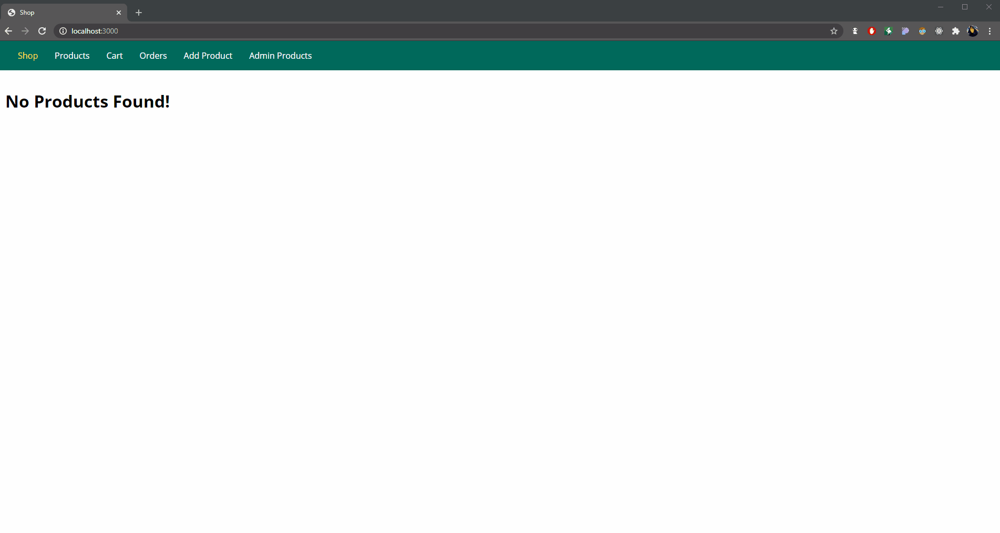

# NodeJS - The Complete Guide (incl. Deno, REST APIs, GraphQL)
> NodeJS E-Commerce Learning Project

Intended to upgrade my back-end skills.

## Usage example

This is an online shop. Functionalities are currently under construction.
An usage guide is soon to follow.

## Built With (Not all are in-use. Technologies were alternated mid-project for learning purposes)

* [Node.js](https://nodejs.org/en/) - JavaScript runtime
* [Express.js](https://expressjs.com/) - Web framework for Node.js
* [Pug](https://pugjs.org/api/getting-started.html) - Compiler/Templating Engine
* [Handlebars](https://handlebarsjs.com/) - Compiler/Templating Engine
* [EJS](https://ejs.co/) - Compiler/Templating Engine
* [MySQL](https://www.mysql.com/) - Relational database management system
* [Node MySQL 2](https://www.npmjs.com/package/mysql2) - MySQL client for Node.js
* [Sequelize](https://sequelize.org/) - Node.js Object-Relational Mapper
* [body-parser](https://www.npmjs.com/package/body-parser) - Node.js body parsing middleware
* [dotenv](https://www.npmjs.com/package/dotenv) - Environment variable waiter
* [pnpm](https://www.npmjs.com/package/pnpm) - The best package manager

## Inspirations and resources

* [NodeJS - The Complete Guide (MVC, REST APIs, GraphQL, Deno)](https://www.udemy.com/course/nodejs-the-complete-guide/) - The course over @ Udemy

## DEMO

<!--  -->
soon

## Installation

*Make sure to have [Git](http://git-scm.com/) and [Node.js](http://nodejs.org/) 10.0.0 (or higher) installed.*

1. Clone it or fork it.

2. Once you have your local copy, install its dependencies using either Yarn:

```
yarn
```

or npm:

```
npm install
```

or my FAVORITE and the one used to build this project - pnpm:

```
pnpm install
```


## Running

After installed, you can start the application by running it with Yarn:

```
yarn start
```

or npm:

```
npm run start
```

or pnpm:

```
pnpm start
```

3. Create an .env file with the following properties according to your local database configuration:

```
DB_HOST=?
DB_USER=?
DB_NAME=?
DB_PASS=?
```

*This will start the server at `localhost:3000`*
<!-- (if you didn't change the `PORT` property on `.env`) -->

## Meta

Gustavo Máximo – gfmaximo97@gmail.com

Many thanks to [Maximilian Schwarzmüller](https://twitter.com/maxedapps?ref_src=twsrc%5Egoogle%7Ctwcamp%5Eserp%7Ctwgr%5Eauthor) over @ [Academind](https://academind.com/) for making this possible!

## Contributing

I'm not currently accepting pull requests as this is a personal project for both learning and career aspiration purposes.
Feel free to fork it however.

## License

This repository is licensed under [MIT](https://opensource.org/licenses/MIT)
