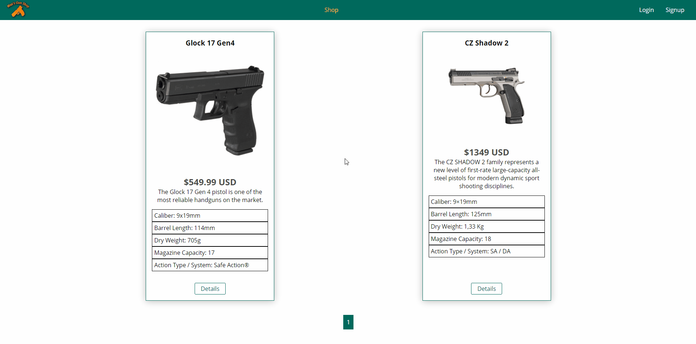
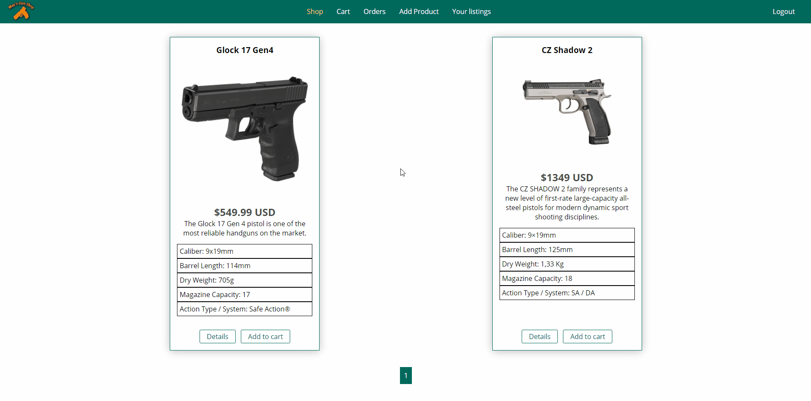
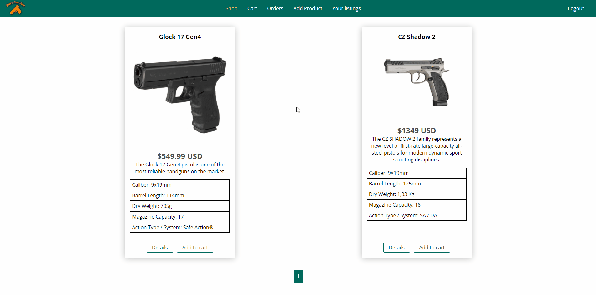
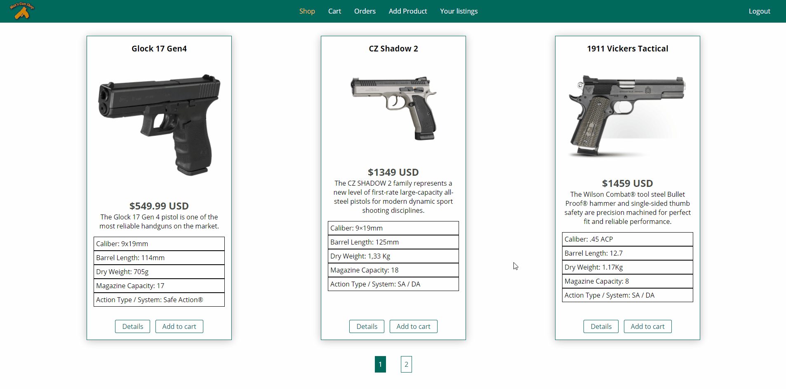

<p align="center">
    
</p>

## Max's Gun Shop - What is it?
> Node.js Learning Project intended to upgrade my back-end skills.

This is a functional dummy e-commerce to buy and sell firearms.

## Built With

#### Currently in-use:
* [Node.js](https://nodejs.org/en/) - JavaScript runtime
* [Express.js](https://expressjs.com/) - Web app framework for Node.js
* [MongoDB](https://www.mongodb.com/) - Document-oriented Database
* [Mongoose]( https://mongoosejs.com/) - MongoDB ODM for Node.js
* [connect-mongodb-session](https://www.npmjs.com/package/connect-mongodb-session) - MongoDB-backed session storage for connect and Express.
* [bcrypt](https://www.npmjs.com/package/bcrypt) - Password hashing lib.
* [csurf](https://github.com/expressjs/csurf) - Node.js CSRF protection middleware.
* [EJS](https://ejs.co/) - Compiler/Templating Engine
* [body-parser](https://www.npmjs.com/package/body-parser) - Node.js body parsing middleware
* [nodemailer](https://nodemailer.com/) - Email client
* [pdfkit](https://pdfkit.org/) - PDF generator for invoices
* [stripe](https://stripe.com/) - Online payment processing
* [dotenv](https://www.npmjs.com/package/dotenv) - Environment variable waiter

#### Used previously:
* [Pug](https://pugjs.org/api/getting-started.html) - Compiler/Templating Engine
* [Handlebars](https://handlebarsjs.com/) - Compiler/Templating Engine
* [MySQL](https://www.mysql.com/) - Relational database management system
* [Node MySQL 2](https://www.npmjs.com/package/mysql2) - MySQL client for Node.js
* [Sequelize](https://sequelize.org/) - ORM for Node.js

(Dependencies were alternated mid-project for learning purposes)

## Inspirations and resources

* [NodeJS - The Complete Guide (MVC, REST APIs, GraphQL, Deno)](https://www.udemy.com/course/nodejs-the-complete-guide/)

I combined my creative freedom with the knowledge gained in the course above to make this application.

## DEMO

### Signup and login



### Shopping (with checkout)



### Adding products



### Pagination



***Every operation has built-in validation with user feedback on the front-end.*


## Installation

*Make sure to have [Git](http://git-scm.com/) and [Node.js](http://nodejs.org/) 10.0.0 (or higher) installed.*

1. Clone it or fork it.

2. Once you have your local copy, install its dependencies using either Yarn:

```
yarn
```

or npm:

```
npm install
```

or the best:

```
pnpm install
```

3. Create an .env file with the following properties according to your local database and nodemailer configuration:

```
DB_USER=*
DB_NAME=*
DB_PASS=*
NODEMAILER_API_KEY=*
```


## Running

After installed, you can start the application by running it with Yarn:

```
yarn start
```

or npm:

```
npm run start
```

or pnpm:

```
pnpm start
```

*This will start the server at `localhost:3000`. You can monitor the DB using [MongoDB Compass](https://www.mongodb.com/products/compass)*
<!-- (if you didn't change the `PORT` property on `.env`) -->

## Meta

Gustavo Máximo – gfmaximo97@gmail.com

Thanks to [Maximilian Schwarzmüller](https://twitter.com/maxedapps?ref_src=twsrc%5Egoogle%7Ctwcamp%5Eserp%7Ctwgr%5Eauthor) over @ [Academind](https://academind.com/) for helping me create this project.

Logo made with Gimp. The silhouette is a CZ Shadow 2.

## Contributing

I'm not currently accepting pull requests as this is a personal project for both learning and career aspiration purposes.
Feel free to fork it however.

## License

This repository is licensed under [MIT](https://opensource.org/licenses/MIT)
